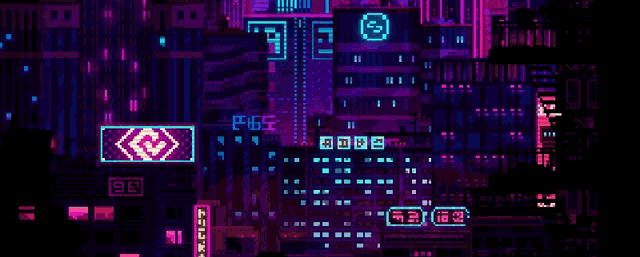

<!-- 

  

 -->

##  About Me 

Hi there! I'm Fede, a developer with experience in FrontEnd and Mobile Applications, currently studying the 5th
year of Systems Information Engineering.
I'm passionate about building impactful tech solutions and continuously learning new tools.

- 💻 Currently working at Novatide Labs.
- 📚 Working as an assistant in Systems Information Design, at Universidad Tecnológica Nacional Facultad Regional Córdoba.  
- 🌱 Learning and improving in Flutter.

---

## ⚙ Technologies ⚙

---

# 📊 GitHub Stats 📊

<table>
  <tr>
    <td>
      
    <td>
      
    </td>
    <td>
      
    </td>
  </tr>
</table>

---

# 📫 Contact Me 📫

- 💼 [LinkedIn](https://www.linkedin.com/in/fdhmz13/)
- 📧 [Email](mailto:federicomizzau.77@gmail.com)

---

  

